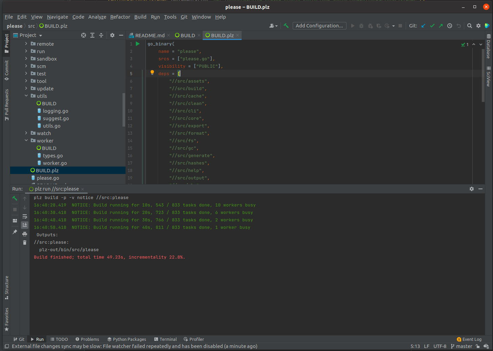

# please-intellij

This project contains a plugin that integrates Please with JetBrains products such as intellij. The plugin adds support
for the Please build language, as well as run configuration to build, test, run and debug build targets. Currently 
only golang targets support debugging however this will be expanded upon in future releases starting with Python.

Run configurations for build, run and test have been added. These can be created from the `Edit configurations` option
in the run configurations dropdown, or via line markers in `BUILD` files. If you're using goland or have the golang 
plugin installed, run configurations can also be created from the run icon next to go tests as well. 

For more information, visit the [plugin page](https://plugins.jetbrains.com/plugin/16816-please).
